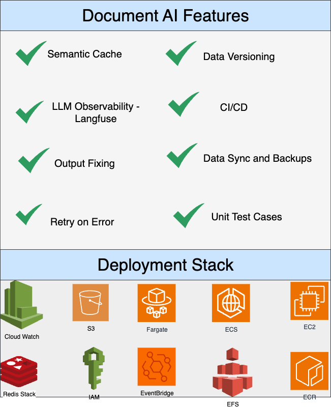
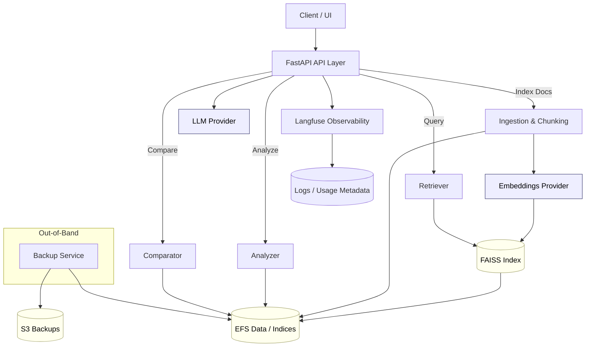
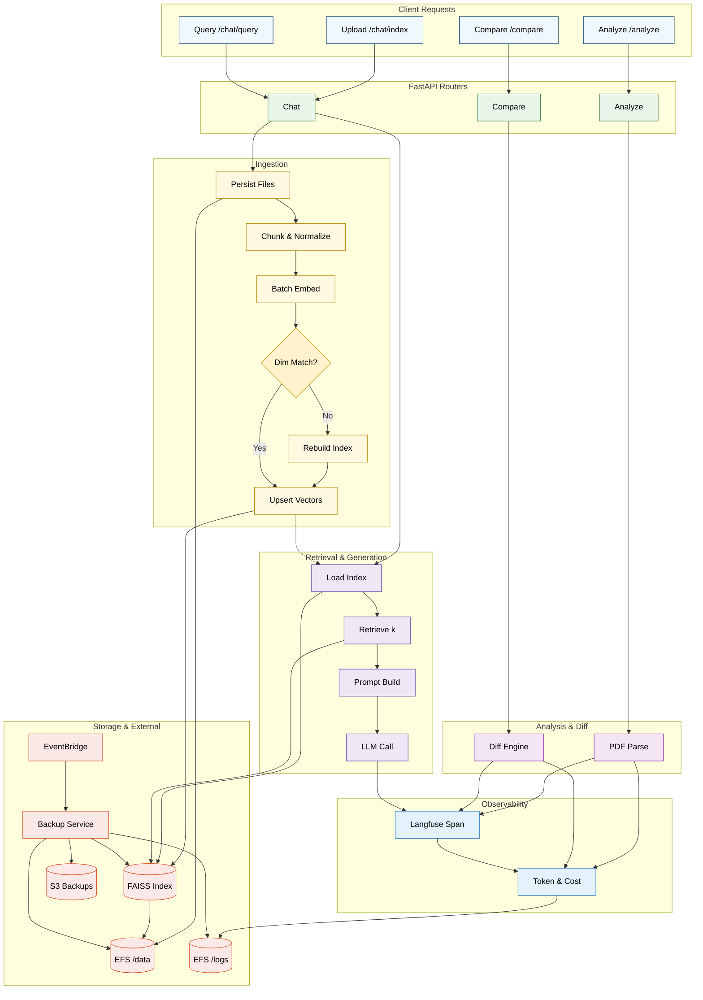
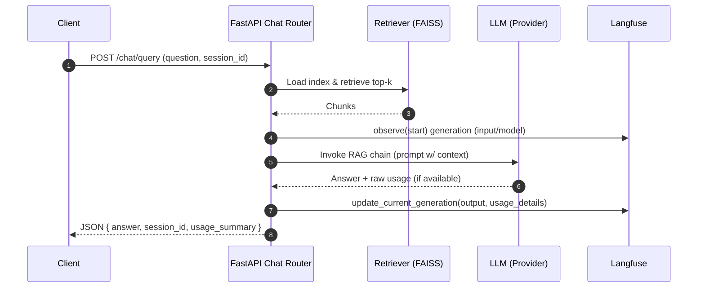
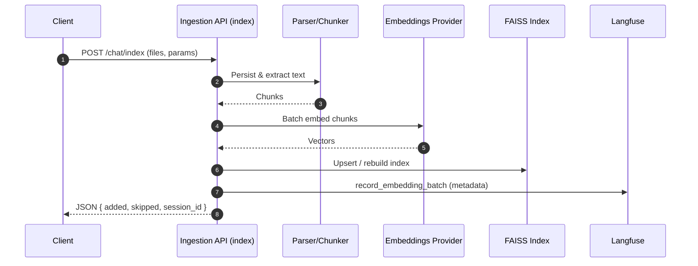
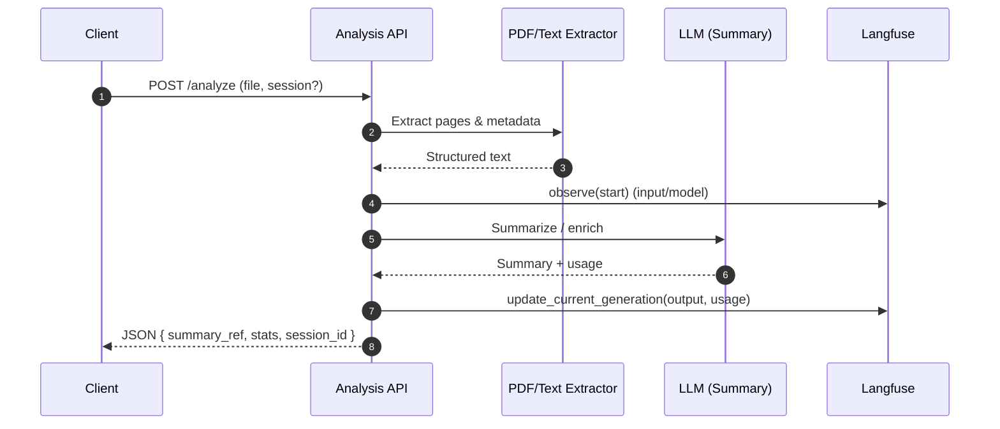
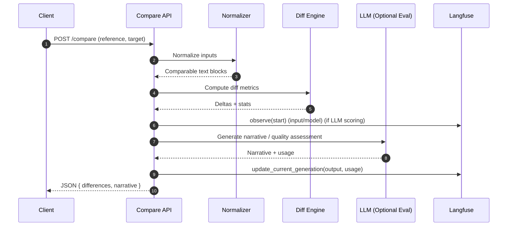
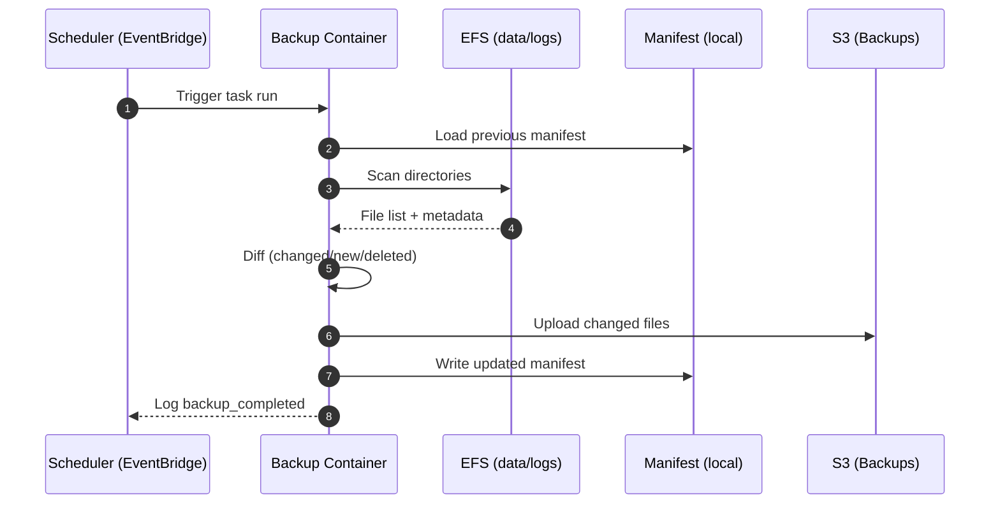

# Document Portal

FastAPI-based platform to analyze, compare, and chat with documents using configurable RAG pipelines (FAISS + multi-provider embeddings / LLMs). Configuration is centralized in `configs/config.yaml`. An independent S3 backup micro-service (in `backup_service/`) handles periodic EFS→S3 snapshots outside the API process.

<div align="center">



</div>

---

## Table of Contents

1. [Introduction](#introduction)
    - [Features](#features)
    - [High-Level Design](#high-level-design)
    - [Low-Level Design & Component Interactions](#low-level-design--component-interactions)
2. [Architecture Overview](#architecture-overview)
    - [Request Flow](#detailed-sequence-request-path)
    - [Backup Flow](#detailed-sequence-backup-task)
    - [Diagrams](#example-ascii-diagram)
3. [Cloud / Infrastructure Architecture](#cloud--infrastructure-architecture)
    - [Core AWS Components](#core-aws-components)
    - [IAM / Security Model](#iam--security-model)
    - [Networking / VPC](#networking--vpc)
    - [CI/CD Pipeline](#cicd-pipeline-github-actions)
4. [Project Structure](#project-structure)
5. [Data Directories](#data-directories)
6. [Prerequisites](#prerequisites)
7. [Installation](#installation)
8. [Configuration](#configuration)
9. [Environment Variables](#environment-variables)
10. [Running the App](#running-the-app)
11. [Core Workflows](#core-workflows)
    - [Chat (RAG)](#1-chat-over-documents-rag)
    - [Document Analysis](#2-document-analysis)
    - [Document Comparison](#3-document-comparison)
12. [Azure OpenAI Specifics](#azure-openai-specifics)
13. [Backup Service](#backup-service)
14. [Logging & Troubleshooting](#logging--troubleshooting)
15. [Development](#development)
    - [Dev Dependencies](#dev-dependencies-uv-groups)
16. [Linting & Formatting](#linting--formatting)
17. [Security](#security)
18. [License](#license)
19. [Support & Connect](#support--connect)

---

## Introduction

The system is designed for teams needing a configurable, provider-agnostic document understanding and retrieval layer with strong observability, token usage tracking, and operational isolation (API vs backup service). Observability leverages Langfuse for generation spans and usage metadata without double-counting inner operations.

## Features

- Config-driven paths, API metadata, and AI settings via YAML
- Versioned API (default `/api/v1`) with OpenAPI docs
- Document analysis (PDF extraction), document comparison, and conversational RAG over your uploads
- FAISS vectorstore with sessionized indexing and idempotent updates
- Provider-pluggable LLM and embeddings with Azure OpenAI support
- Structured logging and helpful exception traces

### High-Level Design

| Concern | Summary |
|---------|---------|
| API Layer | FastAPI routers (`chat`, `analyze`, `compare`, `health`) expose JSON endpoints + minimal HTML landing page. |
| Ingestion & Indexing | PDF/text extraction, chunking, embedding via provider-selected model; FAISS index stored per session (optional) with auto-dimension rebuild. |
| Retrieval-Augmented Generation (RAG) | LCEL chain composes retriever + LLM into final answer; session isolation optional. |
| Analysis & Comparison | Structured extraction & diff operations producing normalized artifacts for consumption / auditing. |
| Observability | Langfuse `@observe` on outer operations + manual `update_current_generation` for token usage & cost inference (pre/post). Single span per logical call. |
| Token & Cost Tracking | Central counter infers usage across providers with tiktoken (exact for OpenAI/Azure) + heuristic fallback. Recorded to Langfuse metadata. |
| Configuration | Central YAML (`configs/config.yaml`) with API metadata, vector DB, retriever, model selection, secrets env var mapping. |
| Backup Service | Decoupled micro-service periodically syncing EFS data/logs to S3 (incremental or archive). No app code imports. |
| Storage Layout | Under `data/` separated by domain, plus per-session subdirectories if enabled. |
| Caching / Optional | Redis semantic cache initialization gated by config & available env keys. |
| Security & Secrets | Keys loaded from aggregated JSON (`API_KEYS`) first, then env fallback, failing fast when missing. |
| Deployment | CI (lint/tests) → conditional ECS build/deploy workflow (main branch gate). |

#### High-Level Workflow (Diagram)



#### Primary Data Flows
1. Upload → Ingest → Embed → Index → Query → Retrieve → LLM Generate → Return answer + usage.
2. Backup scheduler → Enumerate changed files/logs → Manifest diff → S3 upload → Structured log events.

#### Non-Goals
* Not a multi-tenant auth platform (session isolation is filesystem-based only).
* No built‑in advanced access control or billing allocation (can be layered on).

### Low-Level Design & Component Interactions

#### Module Responsibilities
| Module | Key Files | Responsibility |
|--------|-----------|----------------|
| Ingestion | `src/ai/document_ingestion/*` | Normalize document bytes to text chunks; handle idempotent index rebuilds. |
| Retrieval | `src/ai/document_chat/retrieval.py` | Session-aware FAISS retriever & LCEL assembly; wrapper for observed RAG execution. |
| Analysis | `src/ai/document_analyzer/*` | PDF extraction + structured content summarization + generation metadata updates. |
| Comparison | `src/ai/document_compare/*` | Reference vs target diff workflows; attaches usage metadata. |
| Observability | `llm_observability/src/tracing.py`, `src/observability/langfuse_tracing.py` | Span creation, generation metadata enrichment, graceful shutdown flush. |
| Config Loader | `src/utils/config_loader.py` | YAML parsing + environment key override resolution. |
| Model Loader | `src/utils/model_loader.py` | Provider selection, environment loading, secret normalization. |
| Token Counting | `src/utils/token_counter.py` | Approx/ exact token and cost estimation by provider & model. |
| Semantic Cache | `src/utils/semantic_cache.py` | Optional Redis backed embedding similarity cache initialization. |
| Schemas | `src/schemas/api/*` | Pydantic models / form adapters for request validation. |
| Exceptions | `src/utils/exception/*` | Custom exception normalization and consistent error raising. |
| Backup Service | `backup_service/backup_service/*` | Incremental / archive S3 sync; manifest + structured log outputs. |

#### Low-Level Workflow (Diagram)



> Note: EFS provides two mounted paths (`/data` for documents, indices; `/logs` for structured logs). EventBridge triggers the backup task which reads from EFS and writes incremental objects to S3. FAISS index files live under `/data/faiss_index`.

#### Additional Sequences (Detailed)
1. Chat Query: validation → retrieval → RAG chain (@observe) → usage attach → response.
2. Indexing: dimension check → optional rebuild → batch embedding → upsert → counts return.
3. Backup: manifest load → scan diff → upload changed files → manifest write → log summary.

#### Error Handling & Resilience (Summary)
| Aspect | Strategy |
|--------|----------|
| Missing Keys | Immediate exception; prevents partial startup. |
| Index Dimension Mismatch | Automatic index rebuild for that session. |
| Provider Failure | Exception propagated; structured log context. |
| Observability Handler Missing | Loud warning; continue without spans. |
| Parser Failures | Retry + optional output repair chain. |

#### Concurrency & Performance Notes
* Session id namespacing; assume single-writer per session.
* Batched embeddings; idempotent indexing avoids duplicates.
* Optional semantic cache for similar prompt reuse.
* Token estimation cached per model/provider pair.

#### Extensibility Highlights
| Extension | How |
|-----------|-----|
| New LLM Provider | Add branch in model loader + cost map + token encoding fallback. |
| New Vector DB | Adapter implementing retriever contract. |
| Alternate Observability | Swap Langfuse wrapper with unified interface. |
| Multi-Tenant Auth | Middleware + per-tenant root directory structure. |

#### Security Notes
* Centralized secret ingestion.
* Dev tooling isolated from runtime deps.
* No raw secrets in logs.

#### Future Enhancements (Backlog)
* Streaming usage metrics (Prometheus)
* Background re-chunking service
* Provider-native usage for all vendors
* Authorization / tenancy layer

### Detailed Sequence (Request Path)
1. Client calls `/api/v1/chat/index` with documents.
2. API stores raw files in EFS under `data/document_chat[/session]`.
3. Text chunks created; embeddings generated via configured provider and inserted into FAISS index (on EFS).
4. Query requests load retriever from FAISS; RAG chain composes final LLM response.
5. Structured logs stream to CloudWatch (JSON) for observability.

### Detailed Sequence (Backup Task)
1. EventBridge Scheduler triggers ECS runTask (Fargate) using backup task definition.
2. Container mounts the same EFS access points (read-only for data & logs).
3. `backup_service` loads `backup_config.yaml`, performs HeadBucket check, scans include directories.
4. Incremental: For each changed file, upload with key pattern: `<prefix>/<root_dir_name>/<relative_path>`.
5. Manifest updates (if incremental) persisted back to the container writable layer or EFS (if configured in include list).
6. CloudWatch Logs capture `scan_summary`, `file_uploaded`, and `backup_completed`.

### Example ASCII Diagram
```
     +-----------------------+
   User ---> |  API (FastAPI / ECS)  |---+--> Providers (OpenAI/Groq/...)
     +-----------+-----------+   |
         |               |
       (writes / reads)      |
         v               |
      +-------------+        |
      |    EFS      |<-------+
      | (data,logs, |
      |  indices)   |
      +------+------+
         ^
      read-only mount|
         |
    +------------+------------+
    |  Backup Service (ECS    |---> S3 (backups prefix)
    |  Scheduled Task)        |
    +-------------------------+
```

### IAM / Security Model
| Role | Permissions (Summary) |
|------|------------------------|
| ecsTaskExecutionRole | Pull images from ECR, write logs to CloudWatch |
| apiTaskRole | Access secrets (if used), optional S3 (if direct upload), no backup bucket write |
| backupTaskRole | `s3:ListBucket` + `s3:PutObject` (+ `DeleteObject` if pruning) on backup prefix; read-only EFS |
| schedulerRole | `ecs:RunTask` + `iam:PassRole` (execution + backup task roles) |

Principles:
- Separate task roles prevent unintended S3 write surface from API container.
- Backup task runs with least-privilege S3 access (scoped ARN with prefix condition recommended).
- Use EFS Access Points enforcing directory & POSIX ownership.

### Networking / VPC
- Private subnets for ECS tasks (no public IP) behind an ALB (if external access required) or private API Gateway.
- Security Groups: ALB → API (TCP 8080); API & backup tasks → outbound 443 (egress to model providers & S3).
- VPC Endpoints (optional optimization): `com.amazonaws.<region>.s3` and Secrets Manager for reduced NAT usage.

### Observability
- CloudWatch Logs group per task family (e.g. `/ecs/document-portal-api`, `/ecs/document-portal-backup`).
- Metric Filters (optional): count occurrences of `file_upload_failed`, `periodic_run_failed`.
- Alarms on: backup task failures (ECS Task State Change → STOPPED with non‑zero exit), high 5XX rate on API.

### Deployment Pipeline (Example)
1. Build & tag images: `api` and `backup`.
2. Push to ECR repositories.
3. Register / update ECS task definitions (API + backup).
4. Update Service (API) via blue/green or rolling.
5. EventBridge schedules reference latest `:prod` or versioned task definition for backup runner.

### CI/CD Pipeline (GitHub Actions)
This documentation reflects ONLY the two existing workflow files:

1. `.github/workflows/ci.yaml` (workflow name: `CI`)
2. `.github/workflows/aws.yaml` (workflow name: `CI/CD to ECS Fargate`)

#### 1. ci.yaml (Continuous Integration)
Trigger:
- `push` and `pull_request` on branches: `dev`, `main`.

Concurrency:
- Cancels in‑flight runs for the same ref to keep feedback fast.

Permissions:
- `contents: read`, `id-token: write` (prepared for future OIDC), `packages: read`.

Matrix:
- Python versions: 3.10 & 3.11.

Jobs:
`validate` (always on push/PR):
- Checkout
- Python setup (matrix)
- Cache `uv` downloads (`~/.cache/uv`)
- Install `uv` (via pip)
- `uv sync --all-groups` (runtime + dev deps)
- Lint formatting check: `ruff format --check .`
- Lint rules: `ruff check .`
- Tests: `uv run pytest -q` (non-fatal; failure transformed into warning until real tests exist)
- Upload logs artifact (best-effort)

`build` (only when branch == `main` and `validate` succeeds):
- Checkout
- (Optional) QEMU + Buildx setup (enables future multi-arch)
- (Conditional) AWS credential config via OIDC env vars (currently requires env values to be present)
- ECR login if `AWS_REGION` & `AWS_ACCOUNT_ID` provided
- Derive short SHA (first 12 chars) -> `sha_tag`
- Build two Docker images locally (explicit Dockerfiles):
  - API (root Dockerfile): `document-portal-api:<sha_tag>`
  - Backup service (`backup_service/Dockerfile`): `document-portal-backup:<sha_tag>`
- Conditional push of images (only if `ECR_API_REPO` / `ECR_BACKUP_REPO` env values exist) with `:sha_tag` and `:latest` tags.

`deploy` (only when branch == `main` and `build` succeeded):
- Placeholder only (no real ECS update yet). Writes `deploy_notes.txt` artifact reminding to implement task definition rendering & service update.

Notes / Current Limitations:
- This workflow builds images on `main` but does NOT deploy them (deployment happens in the separate `aws.yaml` workflow instead).
- OIDC variables (`AWS_REGION`, `AWS_ROLE_TO_ASSUME`, etc.) must be provided for cloud steps; otherwise only local image build occurs.
- Test step allows failures; tighten by removing the `|| echo ... && exit 0` portion once tests are present.

#### 2. aws.yaml (Continuous Deployment to ECS Fargate)
Trigger:
- `workflow_run` of workflow `CI` when it completes.
- Proceeds ONLY if: conclusion == `success` AND `head_branch == 'main'`.

Environment (fixed in file):
- `AWS_REGION`, `ECR_REPOSITORY`, `ECS_SERVICE`, `ECS_CLUSTER`, `ECS_TASK_DEFINITION`, `CONTAINER_NAME`.

Secrets (required):
- `AWS_ACCESS_KEY_ID`, `AWS_SECRET_ACCESS_KEY` (classic credentials; OIDC not yet used here — could be improved).

Jobs:
`check-status`:
- Guard: ensures CI passed on `main`.

`build-and-push` (needs: check-status):
- Checkout
- Configure AWS credentials (v4 action, static keys)
- Login to ECR
- Build single Docker image (root `Dockerfile`) tagged twice: `:<sha>` and `:latest`
- Push both tags to ECR repository specified by `ECR_REPOSITORY`
- Expose pushed image URI(s) as outputs (`image`, `image_latest`).

`deploy` (needs: build-and-push):
- Checkout
- Configure AWS credentials (older v1 action usage)
- Render ECS Task Definition (file path: `.github/workflows/task_definition.json`) swapping the container image for the new SHA tag via `amazon-ecs-render-task-definition@v1`
- Output rendered JSON
- Deploy updated task definition to the specified Service & Cluster using `amazon-ecs-deploy-task-definition@v1`
- Wait for service stability.

Important Behavioral Nuances:
- Docker image is built twice (if a build step is later added to `.github/workflows/ci.yaml`) and again in `.github/workflows/aws.yaml`. Currently, `ci.yaml` only runs tests/lint, while the deployment workflow (`aws.yaml`) performs the build & deploy. Consolidate builds into one workflow to avoid divergence.
- Deployment only updates ONE container (`CONTAINER_NAME`). If multiple containers (e.g., backup service) need updating, additional render/deploy steps are required.
- Uses static AWS credentials; consider migrating to GitHub OIDC for short-lived tokens.
- `task_definition.json` must exist and contain a container definition whose `name` matches `CONTAINER_NAME`.

Suggested Improvements (Roadmap):
1. Unify build: produce/push images in `ci.yaml` and skip rebuild in `aws.yaml`.
2. Adopt OIDC in `aws.yaml` (replace static keys).
3. Fail CI on test failures once tests exist.
4. Add security scan stage (Trivy) before pushing.
5. Add environment-specific tagging (e.g., `:main-<date>`).
6. Promote backup service image deploy via a second ECS service or scheduled task definition update.
7. Add path filters to skip rebuild when only docs change.
8. Add integration smoke test: run task with new image, curl `/api/v1/health`, then proceed to production service update.

Minimal Sequence:
`push/PR (dev/main)` → CI validate (lint/tests) → (main) build images (local) → CI completes (success) → aws.yaml triggered (main) → rebuild & push image → render ECS task → deploy.

Anchor Reference:
The Table of Contents entry `CI/CD Pipeline` links here via `#cicd-pipeline-github-actions`.

### Alternative (EC2) Note
If not using ECS, you can:
- Run API with systemd / PM2 on EC2, mounting EFS via NFS.
- Use cron or AWS Systems Manager State Manager with a separate EC2 (or the same instance) invoking `backup_service` container via Docker.
ECS/Fargate is preferred for isolation, auto-scaling, and reduced ops overhead.

### Cost & Efficiency Tips
- Incremental mode drastically reduces S3 PUT & data transfer for large, mostly-static document sets.
- Use lifecycle policies on the backup bucket to transition older snapshots to Glacier Deep Archive.
- Compress (archive mode) periodically (e.g. daily) while running hourly incremental uploads.

### Hardening Checklist
- Add KMS encryption (S3 bucket + EFS).
- Enforce bucket policy: deny unencrypted PUT, restrict source VPC Endpoint if used.
- Enable CloudTrail data events for sensitive prefixes (if compliance needed).
- Add WAF (if exposing API publicly) and set rate limits.

## Project Structure

```
configs/
  config.yaml                 # Core application configuration
backup_service/               # Standalone S3 backup micro-service (own pyproject, Dockerfile)
  backup_config.yaml          # Backup-specific YAML (bucket, include_dirs, interval)
  README.md                   # Service usage & deployment guidance
data/                         # Runtime data (mounted / persistent volumes)
logs/                         # JSON log output (if enabled / mounted)
notebooks/                    # (Optional) experimentation
src/
  api/                        # FastAPI app, routers, templates/static assets
  ai/                         # RAG assembly, ingestion, retrieval helpers
  schemas/                    # Pydantic request/response models
  utils/                      # Logging, config loader, bootstrap, semantic cache
  client/                     # HTML templates + static frontend assets
tests/                        # (Add test modules here)
Dockerfile                    # Main API container
docker-compose.yml            # (If used locally)
pyproject.toml                # Root project dependencies
uv.lock                       # Resolved lock (uv)
README.md                     # (This file)
```

### Expanded Source Tree (Key Modules)

```
src/
  api/
    main.py                   # FastAPI app initialization, router inclusion
    routers/
      chat.py                 # Chat (RAG) endpoints (index/query)
      analyze.py              # Document analysis endpoints
      compare.py              # Document comparison endpoints
      health.py               # Liveness / readiness
  ai/
    document_ingestion/       # Normalization, chunking, index management
    document_chat/            # Retrieval + chain assembly (FAISS + LCEL)
    document_analyzer/        # PDF parsing & structured extraction
    document_compare/         # Diff / comparison logic
  observability/
    langfuse_tracing.py       # Startup/shutdown + handler factory
  schemas/
    api/                      # Pydantic request/response schemas
  utils/
    config_loader.py          # YAML + env overlay
    model_loader.py           # Provider env and secret resolution
    token_counter.py          # Token & cost inference
    semantic_cache.py         # Optional Redis semantic cache init
    exception/                # Custom exception types
  client/
    templates/                # HTML template(s)
    static/                   # CSS/JS assets (minimal)
llm_observability/
  src/tracing.py              # Centralized Langfuse span helpers & usage updates
backup_service/
  backup_service/
    backup_core.py            # Incremental/archive logic
    cli.py                    # Entry point
```

---

## Detailed Project Workflow

### 1. Document Indexing (Chat RAG Setup)
1. Client uploads one or more documents to `/api/v1/chat/index`.
2. Files persisted to `data/document_chat[/<session_id>]`.
3. Ingestion layer extracts text → chunks (size & overlap from config).
4. Embeddings generated in batches (provider chosen via env/config).
5. FAISS index (global or per-session) created / updated; dimension mismatch triggers auto-rebuild.
6. Embedding batch usage recorded (`record_embedding_batch`) — no nested span duplication.
7. Response returns counts + session context.

### 2. Query (RAG)
1. User asks question via `/api/v1/chat/query` (with optional session_id).
2. Retriever loads FAISS index; `k` top chunks retrieved.
3. LCEL chain composes system + context + user prompt for selected LLM.
4. `run_chat_rag` executes under Langfuse `@observe` (single generation span).
5. Pre-update sets input + model metadata; post-update attaches usage (tokens, estimated cost).
6. Answer + session id returned.

### 3. Document Analysis
1. Upload call stores PDF under `data/document_analysis[/session]`.
2. Analyzer extracts structured content (text, pages, stats).
3. LLM summarization / enrichment (if configured) updates generation metadata.
4. Artifacts persisted; references returned to caller.

### 4. Document Comparison
1. Reference + target uploaded to comparison endpoint.
2. Normalization + diff logic produce summary & change set.
3. Langfuse generation usage recorded (single logical span).
4. Diff artifacts stored in `data/document_compare[/session]`.

### 5. Backup Cycle (Out-of-Band)
1. Scheduler triggers backup container.
2. Manifest compared to EFS tree (data + logs).
3. Changed files uploaded to S3 with prefix mapping.
4. Manifest updated; structured events logged.

### 6. Startup & Shutdown
1. App loads config + secrets (JSON bundle first, then env fallback).
2. Langfuse handler created (failure logs ALL-CAPS warning, no silent downgrade).
3. On shutdown, handler flush invoked for final span export.

### 7. Token & Cost Accounting
1. For OpenAI/Azure: exact counts via tiktoken + model metadata.
2. For others: heuristic token estimate (character / avg token ratio).
3. Standardized usage_details persisted to Langfuse generation.

---

## Sequence Diagram (Chat Query)



### Sequence Diagram (Document Indexing)



### Sequence Diagram (Document Analysis)



### Sequence Diagram (Document Comparison)



### Sequence Diagram (Backup Cycle)



### Notes
* Only one observed generation per query (no nested spans inside retriever or parser steps).
* Embedding operations are recorded separately but not decorated to avoid trace clutter.
* Usage estimation unified across providers; cost mapping configurable.

---

## Data Directories
Configurable (see `configs/config.yaml`):
- `data/document_chat[/<session_id>]` – Source documents for chat RAG.
- `data/faiss_index[/<session_id>]` – FAISS indices (recreated if embedding dims change).
- `data/document_analysis` – Extracted text & artifacts for analysis.
- `data/document_compare` – Input & diff results for comparison workflows.

## Prerequisites

- Python >= 3.10
- FAISS (faiss-cpu in dependencies)
- Node not required (pure Python backend + minimal HTML templates)

## Installation

Using uv or pip (choose one):

```bash
# Clone your repository
git clone https://github.com/hassi34/document-portal.git
cd document-portal

# Option A: uv (recommended if you use uv)
# uv sync

# Option B: pip + venv
python3 -m venv .venv
source .venv/bin/activate
pip install -e .
```

This project ships a `pyproject.toml` with pinned libraries including:
- fastapi, uvicorn
- langchain, langchain-core, langchain-community, langchain-openai, langchain-google-genai, langchain-groq
- faiss-cpu, pydantic-related deps, pandas, pymupdf, pypdf, python-dotenv

## Configuration

All configuration lives in `configs/config.yaml`.

- API meta, tags, version and server settings: `api.*`
- Data storage directories and supported extensions: `data.*`
- Vector DB (FAISS) name/path: `ai.vector_db.faiss.*`
- Retriever defaults: `ai.retriever.*` (top_k, search_type, chunking)
- Embeddings models per provider: `ai.embedding_model.*`
- LLM models per provider: `ai.llm.*`

Example (excerpt):

```yaml
ai:
  vector_db:
    faiss:
      index_name: "document_portal"
      index_path: "data/faiss_index"

  embedding_model:
    openai:
      model_name: "text-embedding-3-small"
    azure-openai:
      model_name: "text-embedding-3-large"

  retriever:
    top_k: 10
    search_type: similarity
    chunk_size: 1000
    chunk_overlap: 200

  llm:
    openai:
      model_name: "gpt-4o-mini"
      temperature: 0
    azure-openai:
      model_name: "gpt-4o"
      temperature: 0
```

## Environment Variables

Set providers by environment variable. Defaults are OpenAI for both if not set.

- EMBEDDING_PROVIDER: one of `openai`, `google`, `azure-openai`
- LLM_PROVIDER: one of `openai`, `google`, `groq`, `azure-openai`

API keys (validated on startup):

- GOOGLE_API_KEY
- GROQ_API_KEY
- OPENAI_API_KEY
- AZURE_OPENAI_API_KEY

When using Azure OpenAI, also set:

- AZURE_OPENAI_API_INSTANCE_NAME  # e.g., your-resource-name
- AZURE_OPENAI_API_VERSION        # e.g., 2024-10-21
- AZURE_OPENAI_API_DEPLOYMENT_NAME  # chat/completions deployment name (LLM)
- AZURE_OPENAI_API_EMBEDDING_DEPLOYMENT_NAME  # embeddings deployment name

Notes:
- For Azure, use the deployment names you created in Azure AI Studio/Portal, not model names.
- The loader will fail fast if required variables are missing.

### Single JSON env for keys (ECS / secrets managers)

You can provide all API keys via one JSON environment variable, whose name is configurable in `configs/config.yaml` at `secrets.aws_secret_manager_keys_env_var` (default: `API_KEYS`). Example value:

```
{
  "OPENAI_API_KEY": "sk-...",
  "GOOGLE_API_KEY": "...",
  "GROQ_API_KEY": "...",
  "AZURE_OPENAI_API_KEY": "...",
  "AZURE_OPENAI_API_INSTANCE_NAME": "my-azure-openai",
  "AZURE_OPENAI_API_VERSION": "2024-10-21",
  "AZURE_OPENAI_API_DEPLOYMENT_NAME": "gpt-4o",
  "AZURE_OPENAI_API_EMBEDDING_DEPLOYMENT_NAME": "text-embedding-3-large"
}
```

The app reads this JSON first. If a key is not present there, it falls back to a same-named environment variable (only for keys listed in `secrets.known_keys`).

## Running the App

```bash
# From project root, with your venv activated
uvicorn api.main:app --host 0.0.0.0 --port 8080 --reload
```

Open:
- API docs: http://localhost:8080/api/v1/docs
- Redoc: http://localhost:8080/api/v1/redoc
- Minimal UI: http://localhost:8080/

## Core Workflows

### 1. Chat over documents (RAG)

- POST `/api/v1/chat/index`
  - multipart/form-data with one or more files (pdf, docx, txt)
  - form fields (defaults come from config):
    - chunk_size, chunk_overlap, k, session_id (optional), use_session_dirs (bool)
  - Creates/updates a FAISS index for the session.

- POST `/api/v1/chat/query`
  - form fields: question, session_id (required if sessionized), k, use_session_dirs
  - Loads FAISS retriever and runs the RAG chain.

Behind the scenes:
- Files are stored under `data/document_chat[/<session_id>]`
- FAISS indices live in `data/faiss_index[/<session_id>]` with name from `index_name`
- The index manager is idempotent and avoids re-adding the same rows
- If you switch embedding models, the system auto-detects dimension mismatch and rebuilds the index for that session

### 2. Document analysis

- Endpoints allow uploading a PDF and receiving extracted text/resources.
- Saved under `data/document_analysis[/<session_id>]`

### 3. Document comparison

- Upload a reference and an actual PDF to compute differences.
- Saved under `data/document_compare[/<session_id>]`

## Azure OpenAI Specifics

- Embeddings use `AzureOpenAIEmbeddings` and require the embeddings deployment name via `AZURE_OPENAI_API_EMBEDDING_DEPLOYMENT_NAME`.
- Chat LLM uses `AzureChatOpenAI` and requires `AZURE_OPENAI_API_DEPLOYMENT_NAME`.
- Endpoint is constructed from `AZURE_OPENAI_API_INSTANCE_NAME` as `https://<instance>.openai.azure.com/`.

Common pitfalls:
- Using model name instead of deployment name in Azure env vars
- Mismatched API versions (ensure `AZURE_OPENAI_API_VERSION` matches your resource capability)

## Backup Service

The backup micro-service lives in `backup_service/` and runs independently (ECS Scheduled Task / cron-like). Highlights:
- YAML-driven (`backup_service/backup_config.yaml`).
- Modes: incremental per-file (mtime+size diff with manifest) or archive (`tar.gz` snapshot).
- Directory include list (e.g. `/data`, `/logs`) maps to mounted volumes; uploaded S3 keys use relative paths `prefix/<root_name>/...`.
- Early S3 connectivity check (HeadBucket) and JSON structured logs: `scan_summary`, `file_uploaded`, `backup_completed`.
- See `backup_service/README.md` for: EventBridge Scheduler, IAM policies, Docker build, local testing.

Basic one-shot run (from within `backup_service/`):
```bash
uv sync
uv run -m backup_service.cli --config backup_config.yaml --once
```

Override bucket/prefix on the fly:
```bash
uv run -m backup_service.cli --config backup_config.yaml --bucket my-bucket --prefix adhoc/ --once
```

## Logging & Troubleshooting

- Logs are structured and include helpful context; see the `logs/` folder when enabled.
- Typical errors and fixes:
  - 500 during chat index with FAISS dimension mismatch after switching embeddings → auto-reset now handles this; retry indexing.
  - Missing provider keys → set the required environment variables (see above) and restart.
  - OpenAPI not loading → ensure API_VERSION in config is stringifiable; current code handles this.

## Development

- Type annotations and docstrings are being added across modules; contributions welcome.
- Keep changes config-driven; avoid reintroducing hardcoded paths.
- When changing public behavior, add/update tests and docs.

### Dev dependencies (uv groups)

Runtime dependencies are defined under `[project.dependencies]`; tooling (lint, tests, hooks, notebooks) lives in the `dev` group in `pyproject.toml`.

Install only runtime deps (minimal / production-like):
```bash
uv sync
```

Install with dev tools (recommended for contributors):
```bash
uv sync --all-groups          # or
uv sync --group dev           # if you already synced runtime earlier
```

Add a new dev-only tool:
```bash
uv add --dev <package>
```

Common dev commands:
```bash
uv run ruff format            # format code
uv run ruff check .           # lint
uv run pytest                 # run tests
uv run pre-commit run --all-files   # run all hooks manually
```

Update (upgrade) locked versions:
```bash
uv lock --upgrade
```

Production image tip: build without `--all-groups` to exclude test & lint tooling, reducing image size.

## Linting & Formatting

Ruff is used for both lint rules and code formatting.

Format the code (applies changes):

```bash
uv run ruff format
```

Run lint check (no changes, CI will fail on violations):

```bash
uv run ruff check .
```

Common tasks:

```bash
# 1. Format then lint (no auto-fixes besides formatting)
uv run ruff format && uv run ruff check .

# 2. Auto-fix ALL safe lint issues (including import ordering), then re-format
uv run ruff format && uv run ruff check . --fix && uv run ruff format

# 3. Only fix import ordering (I rules)
uv run ruff check . --select I --fix

# 4. CI style (fail if formatting or lint differs)
uv run ruff format --check . && uv run ruff check .
```

Typical CI pipeline runs `uv run ruff format --check .` and `uv run ruff check .` (order can be swapped). Keep formatting and lint separated so failures are clearer.

### Pre-commit (recommended)

Install the framework (project-local dev dependency with uv):

```bash
uv add --dev pre-commit
uv run pre-commit install
```

Run on all files (first time or CI):

```bash
uv run pre-commit run --all-files
```

The config lives in `.pre-commit-config.yaml` and currently includes:
- Ruff (lint with autofix + format)
- Basic hygiene: end-of-file-fixer, trailing-whitespace, YAML syntax, large file guard

Update hook versions periodically:

```bash
uv run pre-commit autoupdate
git add .pre-commit-config.yaml
```

Activation confirmation:

After running `uv run pre-commit install` you should see a file at `.git/hooks/pre-commit` (generated by the framework). Committing any change will now automatically run the hooks; failures abort the commit.

Troubleshooting:
- Hook not running? Re-run: `uv run pre-commit install`.
- Still not running? Check executable bit: `ls -l .git/hooks/pre-commit` (should have `x`). If missing: `chmod +x .git/hooks/pre-commit`.
- Want to bypass once? Use: `git commit -m "msg" --no-verify` (not recommended routinely).
- Slow first run: hooks create a cache under `~/.cache/pre-commit`; subsequent runs are faster.

### Manual Git hook (alternative / local only)

Create `.git/hooks/pre-commit` if you explicitly do not want the framework:

```bash
#!/usr/bin/env bash
set -euo pipefail
# Format
uv run ruff format
# Lint & auto-fix what’s safe
uv run ruff check . --fix
# Enforce final formatting & no remaining issues
uv run ruff format --check .
uv run ruff check .
```

Make it executable:

```bash
chmod +x .git/hooks/pre-commit

> Prefer the pre-commit framework for team consistency and CI reuse.
```

## Security

- Do not commit secrets. Prefer environment variables or secret managers.
- The debug endpoint is gated behind a config flag.

## License

This project is licensed under the terms of the LICENSE file included in the repository.

## Support & Connect

If this project helps you, please ⭐ the repository — it really helps others discover it.

You’re welcome to connect or reach out on LinkedIn:
- https://www.linkedin.com/in/hasanain-mehmood/

Ideas, issues, improvements? Open an issue or PR. Collaboration is encouraged.
